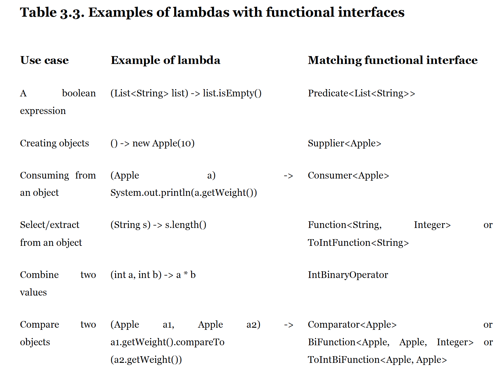
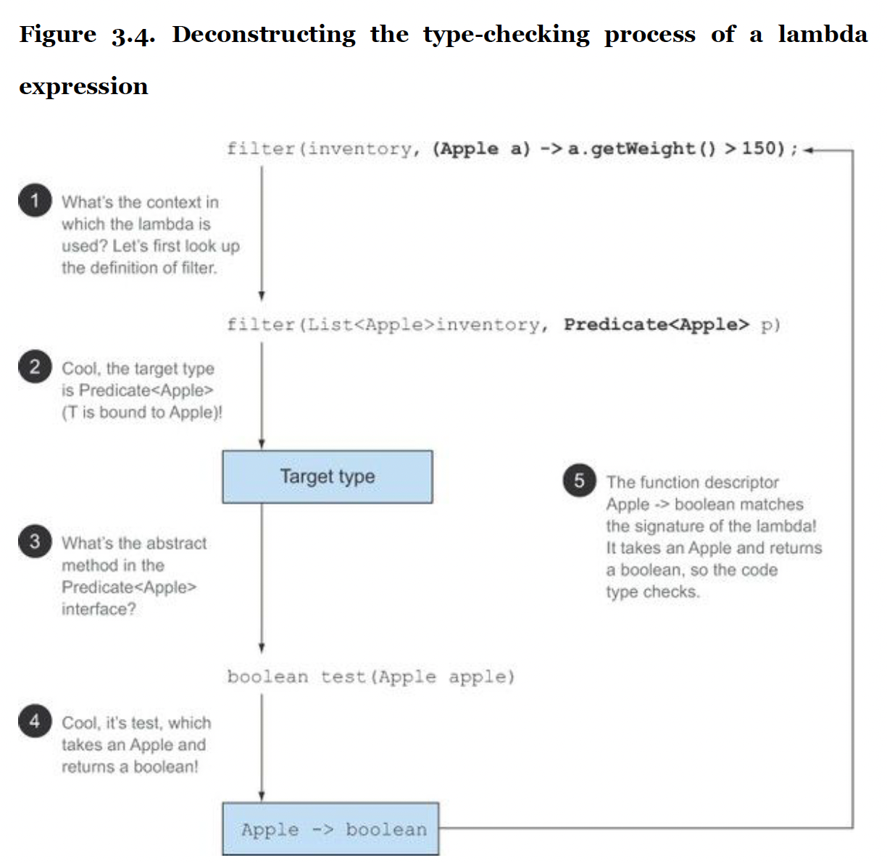
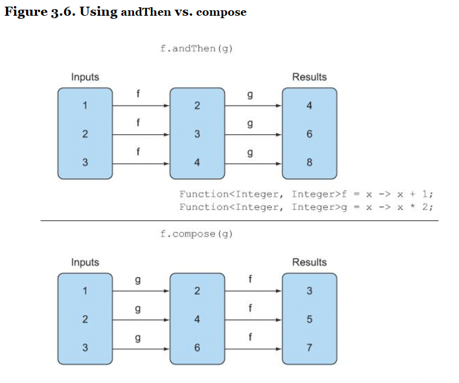

# Lammbdas in a nutshell

A lambda expression can be thought as concise representation of a anonymous function that can be passed around. 

- Concise: because avoids boilerplate code.
- Anonymous: Doesn't have a explicit name. 
- Function: Isn't directly associated to a class. But like a methos, It does have a list of parameters, body and possible exceptions.
- Passed around: A lambda expression can be passed as argument to a method or stored in a variable.

Encourages behavior parametrization.

Before Java 8: 

``` java
    Comparator<Apple> byWeight = new Comparator<Apple>() {
        public int compare(Apple a1, Apple a2){
            return a1.getWeight().compareTo(a2.getWeight());
        }
    };
```

After Java 8: 
``` java
    Comparator<Apple> byWeight =
        (Apple a1, Apple a2) -> a1.getWeight().compareTo(a2.getWeight());
```

## Format of a Lambda expression
(Apple a1, Apple a2) -> a1.getWeight().compareTo(a2.getWeight())
- List of Parameter
- An arrow
- And Body

### Examples

1. ``` java (String s) -> s.length() ```
    - One parameter of type `String` and return `int`. No need to write `return`. Its implied.
2. `(Apple a) -> a.getWeight() > 50`
    - One parameter and returns boolean
3. Two parameters. returns void.Two Statements.

``` java 
    (int x, int y) -> {
        System.out.println("Value of X = " + x);
        System.out.println("Value of Y = " + y);
    }
```


# Where and how to use lambdas
- A lambda expression can be used in context of functional interface

## Whats a functional Interface? 
- A functional interface is an interface that specifies exactly one abstract method.
- It can have other default methods.
- There are already such interfaces available

### Example: 
1. ``` java
    public interface Comparator<T> {
        int compare(T o1, T o2);
    }

2. ``` java
    public interface Runnable<T> {
        void run();
    }

3. ``` java
    public interface Callable<T> {
        T call();
    }

> Lambda expression allows us to provide implementation of a functional interface inline and treat the whole expression as an instance of functioncal interface.

### Example

``` java 

    Runnable r1 = new Runnable() {
        void run()  {
            System.out.println("Hello There");
        }
    };

    Runnable r2 = () -> System.out.println("Hello There");

    public static void process(Runnable r) {
        r.run();
    }

    process(r1);
    process(r2);

    process(() -> System.out.println("Hello There Inline"))
```

## Function Descriptor
- The signature of the abstract method in functional interface essentially describes the signature of lambda expression. It is also known as function descriptor.

For example, the `Runnable` interface can be viewed as the signature of a `function` that accepts nothing and returns nothing `(void)` because it has only one abstract method called `run`, which accepts nothing and returns nothing `(void)`.

## Java 8 functional interfaces


# Practice: The Execute around pattern
Say you want to read content from a file and want to perform different action on top of it. For e.g.:
- Read n number of lines.
- Count no. of words
- count the frequency of words

For such cases we would always do read file and close file and in between do some specific thing. This is called `Execute Around Pattern`.

[FileProcessor.java](src/main/java/com/example/FileProcessor.java) showcases how this can be acheived using Lambda expressions.

# Java 8 functional interafaces and their usage


## Primitive specializations
- We described three functional interfaces that are generic: `Predicate<T>`, `Consumer<T>`, and `Function<T, R>`. There are also functional interfaces that are specialized with certain types.
- Although `Function<String, Integer>` is a valid usage. Using this interface directly might cause performance overhead due to java auto-boxing operations.
- That's why we have specialized version of the functional interfaces we described earlier in order to
avoid autoboxing operations when the inputs or outputs are primitives.

Example: 
``` java
    IntPredicate evenNumPredicate = i -> (i % 2) == 0;
    evenNumPredicate.test(1000);

```

# Exception Handling
- None of the functional interfaces above throws a Checked Exception.
- We are left with two options
    - Define our own functional interface and throw the exception.
    - Wrap the Lambda with a `Try-Catch` block.

# Type Checking
- Type is determined by the context where Lambda is being used. For example a method parameter or a variable being assigned to. It is called `Target Type`. 



## Same Lambda different functional interfaces
- Because of the idea of `Target Type` checking, a single Lambda Expression can be assigned to variables of multiple types.

Below code snippets shows this: 
``` java
    Comparator<Apple> c1 = (Apple a1, Apple a2) -> a1.getWeight().compareTo(a2.getWeight());
    
    ToIntBiFunction<Apple, Apple> c2 = (Apple a1, Apple a2) -> a1.getWeight().compareTo(a2.getWeight());
    
    BiFunction<Apple, Apple, Integer> c3 = (Apple a1, Apple a2) -> a1.getWeight().compareTo(a2.getWeight());
```

## Special void-compatibility rule 
- If a lambda has a statement expression as its body, it’s compatible with a function descriptor
that returns void (provided the parameter list is compatible too).

Below code is perfectly valid: 

``` java
    // Predicate has a boolean return
    Predicate<String> p = s -> list.add(s);
    // Consumer has a void return
    Consumer<String> b = s -> list.add(s);
```

# Closure: Using local variables


# Method References

Allows us to use existing method definitions and pass them just like Lambdas. In some cases, they appear more readable and clearer.

There are three main kind of method references: 

- A method reference to a static method. For example, `Integer::parseInt`
- A method reference to an instance of arbitrary type. For example `String::toUpperCase`
- A method reference to an instance of an existing Object. For example, `instance::appendStrings`

## References to constructor
You can create a reference to an existing constructor using its name and the keyword new as follows: `ClassName::new`. It works similarly to a reference to a static method.
- If a constructor has two arguements, we need a functional interface that takes two arguments and return a new object.

``` java
public interface TriFunction<T, U, V, R>{
    R apply(T t, U u, V v);
}

And you can now use the constructor reference as follows:
TriFunction<Integer, Integer, Integer, Color> colorFactory = Color::new;
```

# Useful methods to compose lambda expressions
Several functional interface in java 8 API contain convenient methods. Specifically, many functional interfaces such as Comparator, Function, and Predicate that are used to pass lambdaexpressions provide methods that allow composition. What does this mean? In practice it means you can combine several simple lambda expressions to build more complicated ones. For example, you can combine two predicates into a larger predicate that performs an or operation between the two predicates.

## Composing and Chaining Comparators

``` java 

    Comparator<Apple> c = Comparator.comparing(Apple::getWeight);
    inventory.sort(c);

    inventory.sort(c.reversed());

    inventory.sort(comparing(Apple::getWeight).reversed().thenComparing(Apple::getCountry))
```

## Composing and Chaining Predicates
Predicate interface has three methods: 

- and 
- or
- negate 

Example: 
``` java
Predicate<Apple> redApple = (Apple a) -> a.getColor().equals("red");

Predicate<Apple> notRedApple = redApple.negate();
Predicate<Apple> redAndHeavyApple = redApple.and(a -> a.getWeight() > 150);

Predicate<Apple> redAndHeavyAppleOrGreen = redApple.and(a -> a.getWeight() > 150).or(a -> a.getColor().equals("green"));

```

> Note that the precedence of methods and and or is managed from left to right using their positions in the chain. So a.or(b).and(c) can be seen as (a || b) && c.

## Composing and chaining function

Two methods in Function interface that can be used to compose lambda functions. 

- andThen
    - f.andThen(g)
    - equivalent to `g(f(x))`
    - Apply f first and then apply g on the result of f
- compose
    - f.compose(g)
    - equivalent to `f(g(x))`
    - Apply g first and then apply f on the result of g




